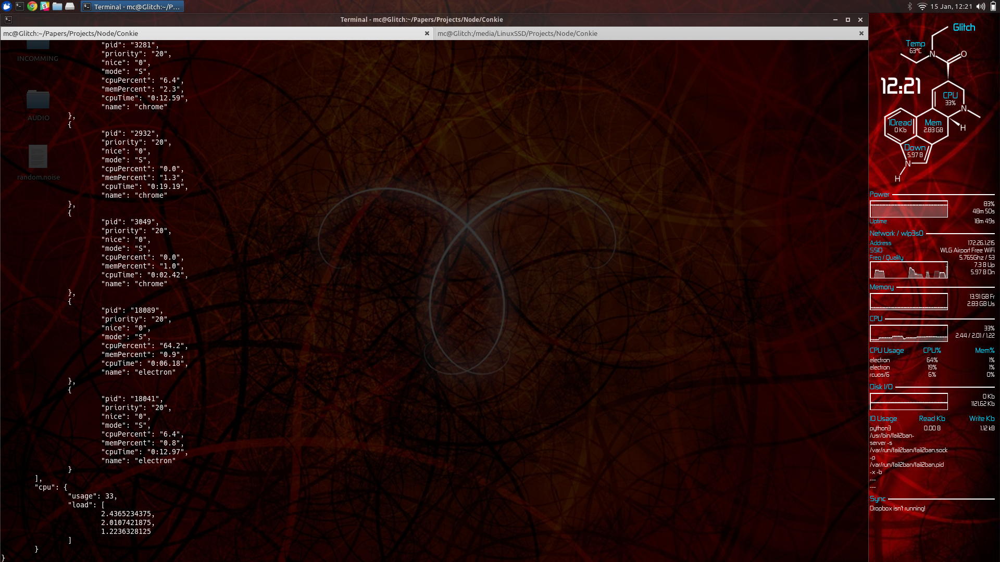

Conkie
======
NodeJS + Electron desktop widgets.

This project is designed to replace the seminal [Conky project](https://github.com/brndnmtthws/conky) by Brenden Matthews with a Browser based desktop widget.

Conkie relies on a few things to gather system statistics. The upstream repo [Conkie-Stats](https://github.com/hash-bang/Conkie-Stats) details these. Basic install info is provided below.

**ARE YOU A DESIGNER?**

Please get in touch. I could really do with a bit of design help with perfecting this project.

Installing
==========

	# Install all Conkie's external statistics gathering tools
	sudo apt-get install bwm-ng lm-sensors iotop

	# Install Conkie itself
	npm install -g conkie

Run with:

	conkie

Use `--help` for other command line help.

Themes
=======
Conkie themes are a single HTML file which links to other required assets. You can override the default by specifying `--theme <path to file>`.

To create a Conkie theme simply design your webpage as you require and make a call to `require('electron').ipcRenderer.on('updateStats', ...)` to gather system statistics. Some examples are provided in the [themes](./themes) folder using AngularJS.

Tips:

* To keep NPM happy all dependencies should be NPM modules themselves. For example if you require Bootstrap use `var bootstrap = require('bootstrap')` somewhere in your themes JavaScript.
* A lot of weird and wonderful kludges and fixes exist to try and load your widgets contents inline. See the bottom of this README for the nasty internal details.

Theme API Reference
-------------------
The following objects are provided as callbacks within the internal IPC `updateState` listener.

All statistics are provided via the [Conkie-Stats](https://github.com/hash-bang/Conkie-Stats) module. See its API for a list of modules and data feeds it supports.

e.g.

	require('electron').ipcRenderer

		// Listen to stats updates
		.on('updateStats', function(e, data) {
			// data now has `system`, `ram`, `net` etc. subkeys
			// Do something with this data
		})

		// Request statistics feeds
		.send('statsRegister', ['cpu', 'memory'])

		// Setup any stats options
		.send('statsSettings', {})

		// Setup the window position
		.send('setPosition', {left: 10, top: 10, width: 200, height: 100%'})

##EVENT: updateStats(event, stats)##

Receive a stats object from the [Conkie-Stats](https://github.com/hash-bang/Conkie-Stats) module. The available data depends on what modules were registered using the `registerStats()` message.

##METHOD: setPosition(obj)##

Set the position of the widget on the screen.

The payload for this message is an object composed of one or more of the following:

| Key             | Type                | Default              | Description                   |
|-----------------|---------------------|----------------------|-------------------------------|
| `left`          | Number, String      | 10                   | The left offset of the widget |
| `top`           | Number, String      | 10                   | The top offset of the widget  |
| `width`         | Number, String      | "33%"                | The width of the widget       |
| `height`        | Number, String      | "100%"               | The height of the widget      |

These values can be straight Numbers, negative numbers (for right alignment e.g. '-10' => right edge minus 10), "center", "middle" or any other value accepted by the [box-sizing](https://github.com/hash-bang/box-sizing) utility module.

##METHOD: statsRegister(...mods)##

Request the registration of the given modules from Conkie-Stats. This message can accept an array of modules or each module as a separate argument.

##METHOD: statsSettings(settingsObject)##

Set the Conkie-Stats settings object. This usually tweaks the behaviour of various modules to do things like ignoring specific network adapter or limiting the number of returned processes.

Detailed Theme loading process
------------------------------
At the moment a fair amount of workarounds are in place to fix up various weird Electron issues (such as loading inline CSS).

The theme file gets read into memory then re-written on the fly to read each external JS / CSS asset and insert it into the file as inline content. In *most* cases this should be sufficient but it is a pretty horrible kludge. This is because Electron apps straddle the boundary between desktop apps and web pages where stuff like loading external CSS is still a bit iffy. Please get in touch with feedback if the solution I've implemented is needlessly insane but I honestly couldn't find a decent method of loading CSS from NPM modules.
